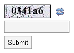

# AVCaptcha

- Version 1.2.0.
- This is a simple drop-in anti-spam CAPTCHA script written in PHP.
- PHP version 7+, 8.0+.
- It is loosely based on the CodeWalkers.com Simple PHP CAPTCHA (no longer online).
- Provided without any warranty or implication of fitness for any purpose.
- CAPTCHA difficulty (strength) is low to moderate, however custom captchas are usually not already broken by spammers.
- Extend this sample project to build your own captcha!
- You may use and modify this script for any purpose as long as this README.md file and the following line is kept with the script:

Author: Sherri Wheeler (syntaxseed.com). License: MIT.

## Usage

Refer to the example.php file for a complete usage example.

Configuration settings are found at the top of the avcaptcha.php file.

## Fonts

True Type Fonts can be found in various places online. Google's *Viga* font has been included as an example. Recommended to use an unusual font to increase captcha strength. Sans-serif fonts are more difficult.

- Find the .ttf file you desire and place it in the resources/fonts/ directory in this avcaptcha directory.
- Edit the settings in avcaptcha.php to set the correct font file.

## Version History

- 2022-01-28 - Tested for PHP 8.0 (v1.2.0).
- 2020-03-07 - Updated for PHP 7.3.
- 2020-03-06 - Added to GitHub, improved readme and simplified the code.
- 2009-06-04 - Changed to use a jpg image as a base. Otherwise doesn't work in some environments.
- 2009-02-12 - Removed the need for the external JS file. Now uses inline JS for the reload button.
- 2009-02-11 - Created AVCaptcha.
